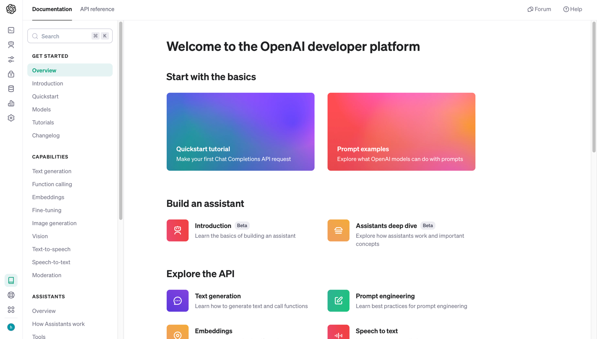
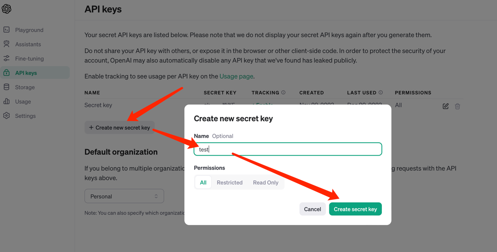
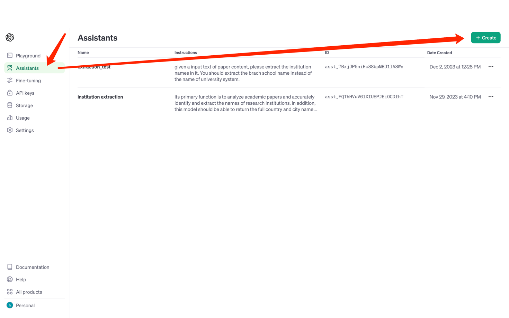
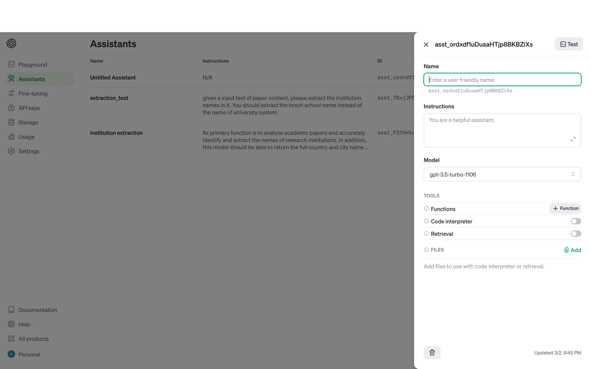
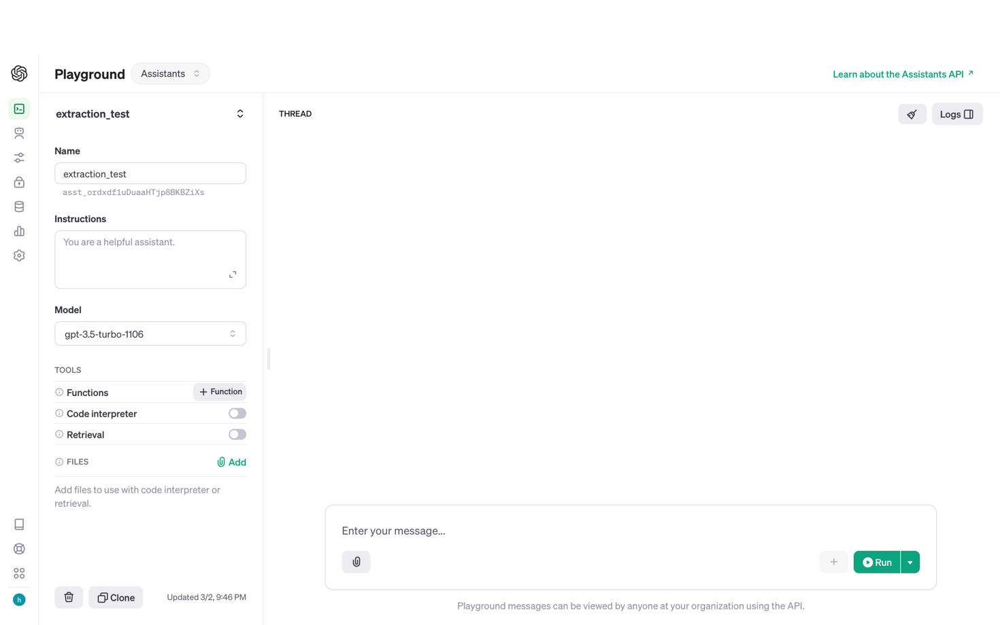

# paper-metadata-extract

## set up environment
the dependencies of this project:

Mysql: 8.2.0

elasticsearch-8.11.1

python-3.11

## Configure the openAI's API

### 1.Sign up and login to the openAI developer account

### 2.Get the API key, which is used for verify the identity when calling API

Note: You should record the generated API Key carefully, since if you loss it there is no way to recover it from the platform
### 3. Create and configure the assistant API
As the steps shown in following figure, create an assistant

Then configure the new assistant. Input the name, prompt and version of model.

### The prompt for this version:

Its primary function is to analyze academic papers and accurately identify and extract the names of research institutions. In addition, this model should be able to return the full country and city  name of the institution. Country names must be full names, not abbreviations. This model is particularly skilled at understanding the context of academic literature, which enables it to recognize scientific organizations and institutions effectively.  It is designed to make well-informed guesses in cases where the identification of an institution might be ambiguous and is programmed to avoid extracting names of non-public founding institutions. This version is tailored to ignore department names within institutions, concentrating solely on university-level names. It discerns between main campuses and branches ensuring accuracy in its extractions. The model responds primarily in JSON format, focusing on delivering structured and precise information about the institutions identified in the academic texts. It is programmed to handle queries related to its specialization with a professional and efficient interaction style. 
Queries that are off-topic or not related to academic literature will result in an empty JSON response, adhering to its specialized purpose. the format of returned json object should be: {
  "extracted_institutions": [
    {
      "name": ,
      "country": ,
      "city":
    }
  ]
}

### Select the version of model
gpt-3.5-turbo-1106

Due to the limitation of budget, we select GPT3.5 model, since it is much cheaper than GPT4 and can also yield ideal result as GPT4

Note: This step is crucial, as the same prompt may yield different outcomes when used with different models.

After you configure the assistant, record the id of this assistant, it will be used in calling for this API

### 4.Test the performance of assistant

Now you created a assistant API. To test the behavior of this model you can click the upper right button "Test". Then you will direct to playground and interact with this model just like chatting with chatgpt

If the outcome of this model meet the expectation, then we can integrate it into our system. Otherwise, use additional prompt to optimize this model.

## Integrate the openAI's API to current system

In text/extractWithChat.py:
at around the 20th line of code 
  ```python  
client = OpenAI(
    api_key='',  # this is also the default, it can be omitted
  )
  ```
Fill in the api_key with your key generated in the last step

Also at 56 line of code, fill in the assistant_id you have just created

```python
  run = client.beta.threads.runs.create(
    thread_id=thread.id,
    assistant_id='',
    instructions=""
  )
```

## Install Elastic Search and populate the database

We need the search engine to process the output of GPT. The name and location of that institution is used as keyword to retrive the best match result from elastic search.

The ror data prepared for elastic search is located at text/import2ES.csv, you should import this data into elastic search to make the system work